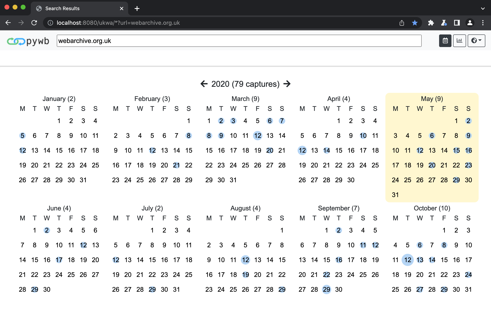
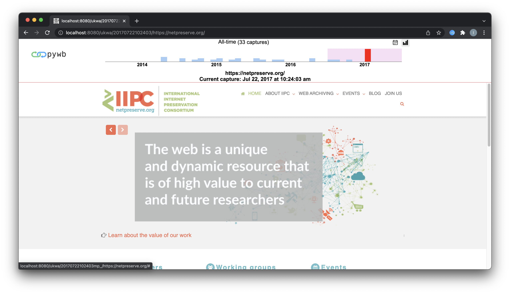

.. _vue-ui:

Vue-based UI
================

With 2.7.0, pywb introduces a new `Vue UI <https://vuejs.org/>`_ based system, which provides a more feature-rich representation of a web archive.

Overview
--------

Calendar UI
^^^^^^^^^^^

The new calendar UI provides a histogram and a clickable calendar representation of a web archive.

The calendar is rendered in place of the URL query page from versions before 2.7.0.

Banner Replay UI
^^^^^^^^^^^^^^^^

The new banner histogram allows for zooming in on captures per year, month, week, and day.

Navigation preserves the different levels. The full calendar UI is also available as a dropdown by clicking the calendar icon.

The new banner should allow for faster navigation across multiple captures.

Custom Logo
^^^^^^^^^^^

It is possible to configure a custom logo by setting ``ui.logo`` in ``config.yaml`` to a static file.

If omitted, the standard pywb logo will be used by default.

If set, the logo should point to a file in the static directory (default is ``static`` but can be changed via the ``static_dir`` config option).

For example, to use the file ``./static/my-logo.png`` as the logo, set:

.. code:: yaml

  ui:
    logo: my-logo.png

Logo URL
^^^^^^^^

It is possible to configure the logo to link to any URL by setting ``ui.logo_home_url`` in ``config.yml`` to the URL of your choice.

If omitted, the logo will not link to any page.

For example, to have the logo redirect to ``https://example.com/web-archive-landing-page``, set:

.. code:: yaml

  ui:
    logo_home_url: https://example.com/web-archive-landing-page

Banner Colors
^^^^^^^^^^^^^

It is possible to configure the background color, text color, and button outlines of the header by setting values in the ``ui`` section of ``config.yaml``.

To customize the header background color, set ``ui.navbar_background_hex`` to the color's hex value, with the initial hash symbol (``#``) omitted. If omitted, ``#f8f9fa`` (Bootstrap 4's ``light``) will be used by default.

For example, to use the color ``#cff3ff`` as the banner color, set:

.. code:: yaml

  ui:
    navbar_background_hex: cff3ff

The navbar text color can similarly be set using the ``ui.navbar_color_hex`` setting.

The banner's buttons default to Bootstrap 4's ``btn-outline-dark``. To use light-outlined buttons instead, set ``ui.navbar_light_buttons`` equal to any value.

Updating the Vue UI
-------------------

The UI is contained within the ``pywb/vueui`` directory.

The Vue component sources can be found in ``pywb/vueui/src``.

Updating the UI requires ``node`` and ``yarn``.

To install and build, run:

.. code:: console

   cd pywb/vueui
   yarn install
   yarn build

This will generate the output to ``pywb/static/vue/vueui.js`` which is loaded from the default templates when the Vue UI rendering is enabled.

Additional styles for the banner are loaded from ``pywb/static/vue_banner.css``.
