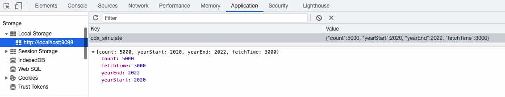

# How to incorporate CDX Simulator

Place following code snippets in **index.js**

## Import  `CDXQueryWorkerSimulator` Mock Class

It is the mock class to the main javascript built-in `Worker` class:

   ``import { CDXQueryWorkerSimulator } from "./cdx-simulator/cdx-simulator";``

## Initialize `queryWorker` with Mock Class

Update `const queryWorker = ...` initialization in `CDXLoader` class, `loadCDX()` method
   
### by replacing it

```
const queryWorker = new CDXQueryWorkerSimulator(this.staticPrefix + "/queryWorker.js");
```

### or by adding a conditional, so you can go back and forth between simulator and real CDX-data-loader:

for example with a URL-hash flag conditional:

```
const queryWorker = new (window.location.hash.indexOf('cdx_simulate') >= 0 ? CDXQueryWorkerSimulator : Worker)(this.staticPrefix + "/queryWorker.js");
```

NOTE: where if the url contains '#cdx_simulate' the mock simulator will be used; using a URL hash does not interfere with the main URL parsing of the PYWB app

## Configure Simulation 

Add a **local** storage (from Chrome Dev Tools > Application > Local Storage)

```
{"count":5000, "yearStart":2020, "yearEnd":2022, "fetchTime":3000}
```

where `count` is the total records, yearStart and yearEnd are self-explanatory, and `fetchTime` is how long it should take

